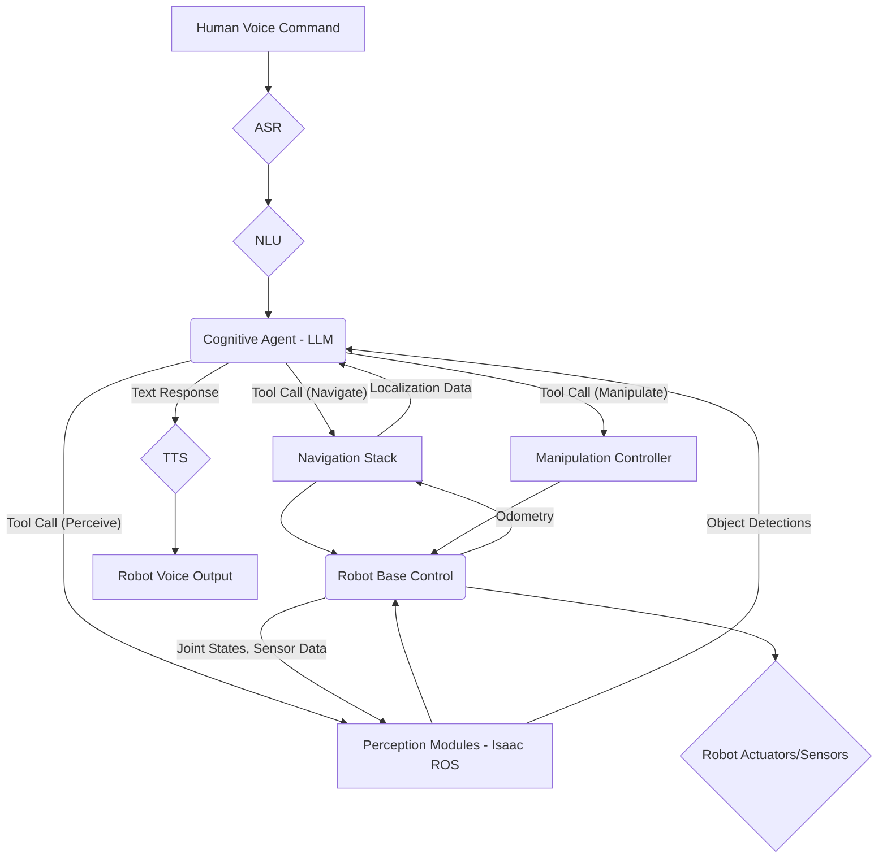

# Chapter 5.1: Capstone Architecture: Designing an Autonomous Humanoid System

**Chapter ID**: 5.1
**Module**: Capstone – Autonomous Humanoid
**Authors**: Gemini Agent
**Last Updated**: December 4, 2025

## 🎯 Learning Objectives

By the end of this chapter, you will be able to:
*   Design a high-level architecture for an agent-powered, conversational humanoid robot.
*   Understand how different modules (perception, planning, control, language) integrate within a VLA framework.
*   Identify the communication flow and data structures between key robotic components.
*   Appreciate the role of the central cognitive agent in orchestrating complex humanoid behaviors.

## ✨ Core Concepts

### Overview of the Humanoid System Architecture

The capstone project culminates in building a simulated conversational humanoid robot. This requires integrating all the concepts learned so far: ROS 2 for communication, Gazebo/Isaac Sim for simulation, NVIDIA Isaac ROS for perception, and Vision-Language-Action (VLA) systems for intelligence. The architecture is modular and distributed, centered around a powerful cognitive agent.

#### Key Terms
*   **System Architecture**: The conceptual model that defines the structure, behavior, and more views of a system.
*   **Modular Design**: Breaking a system into smaller, independent, interchangeable units.
*   **Distributed System**: Components located on different networked computers that communicate by passing messages.

### The Central Role of the Cognitive Agent

At the heart of our humanoid's intelligence is the **Cognitive Agent**, powered by the Gemini LLM (via the OpenAI Agent SDK). This agent acts as the brain, responsible for:
*   **Interpreting Human Commands**: Translating natural language into high-level goals.
*   **Task Decomposition**: Breaking down complex goals into executable sub-tasks.
*   **Strategic Planning**: Sequencing robot behaviors and adapting plans based on feedback.
*   **Tool Orchestration**: Invoking specific robotic "tools" (APIs) for perception, navigation, and manipulation.
*   **Dialogue Management**: Maintaining conversational context and generating natural language responses.

### Architectural Layers and Components

The humanoid system can be broadly divided into several interconnected layers:

1.  **Human-Robot Interface (HRI)**:
    *   **Voice Input**: Speech-to-Text (ASR) module capturing human commands.
    *   **Voice Output**: Text-to-Speech (TTS) module for robot responses.
    *   **Visual Feedback**: Displaying robot's state, perceptions, or intentions (e.g., in a GUI or simulation window).

2.  **Cognitive Layer (Agentic)**:
    *   **Cognitive Agent**: The LLM-powered agent for planning, reasoning, and tool orchestration.
    *   **NLU Module**: Extracts intent and entities from text commands.
    *   **Dialogue Manager**: Manages turn-taking and conversational flow.
    *   **Memory**: Stores short-term conversational history and long-term knowledge.

3.  **Perception Layer**:
    *   **Vision Subsystem**: Isaac ROS modules for object detection, segmentation, VSLAM, and 3D reconstruction from simulated camera feeds.
    *   **Auditory Processing**: Localizing sound sources (optional for advanced scenarios).
    *   **Proprioception**: Joint encoders, IMUs providing robot's internal state.

4.  **Planning & Navigation Layer**:
    *   **Global Planner**: Plans high-level paths across the environment (e.g., from current location to target room).
    *   **Local Planner**: Handles immediate obstacle avoidance and trajectory generation.
    *   **Mapping & Localization**: Uses VSLAM outputs to build and maintain a map, and localize the robot within it.

5.  **Manipulation Layer**:
    *   **Inverse Kinematics (IK)**: Calculates joint angles required to reach a target end-effector pose.
    *   **Motion Planning**: Generates collision-free trajectories for the robot arm.
    *   **Grasping Module**: Detects grasp points and controls the end-effector.

6.  **Control Layer**:
    *   **Joint Controllers**: Low-level control of individual robot joints (e.g., position, velocity, effort control).
    *   **Base Controller**: Controls the humanoid's locomotion (e.g., walking, wheel movements).

7.  **Communication Middleware (ROS 2)**:
    *   All layers and components communicate primarily using ROS 2 topics, services, and actions. This provides a standardized, asynchronous, and distributed communication backbone.

### Data Flow and Interaction Example

Consider the command: "Robot, bring me the blue cube from the shelf."

1.  **HRI**: Voice input → ASR converts to "bring me the blue cube from the shelf."
2.  **Cognitive Layer**:
    *   NLU extracts intent: `fetch_object`, object: `blue cube`, source: `shelf`, target: `user_location`.
    *   Cognitive Agent (LLM) breaks this into:
        1.  `navigate(shelf)`
        2.  `perceive(blue cube)`
        3.  `grasp(blue cube_id)`
        4.  `navigate(user_location)`
        5.  `release(blue cube_id)`
3.  **Execution Loop**:
    *   Cognitive Agent calls `navigate(shelf)` tool.
    *   `navigate` tool interfaces with **Planning & Navigation Layer** (ROS 2 Nav2 action).
    *   **Perception Layer** provides VSLAM/object detection feedback to Navigation.
    *   Upon reaching shelf, Cognitive Agent calls `perceive(blue cube)` tool.
    *   `perceive` tool interfaces with **Perception Layer** (Isaac ROS service).
    *   Object detected, ID returned. Cognitive Agent calls `grasp(blue cube_id)` tool.
    *   `grasp` tool interfaces with **Manipulation Layer** (IK, Motion Planning).
    *   **Control Layer** executes joint commands.
    *   Robot navigates back to user, releases object.
4.  **HRI**: TTS outputs "Task completed."

## 💻 Code Examples

This chapter focuses on architectural design. Detailed implementation code will be covered in the next chapter and the lab.

### Example: High-Level ROS 2 Node Graph (Conceptual)

This conceptual graph shows the relationships between major ROS 2 nodes and components in the capstone.

*   **Expected Output**: A visual representation of the interconnected components, highlighting the central role of the Cognitive Agent.

## 🧪 Step-by-Step Lab: [Lab Title]

The full capstone implementation will serve as the primary lab for this module.

## ⚠️ Safety Notes

*   In a complex integrated system, the failure modes can be intricate. Design with redundancy, robust error handling, and clear emergency stops at every layer.
*   The human-robot interface, especially with voice control, must be designed to prevent misinterpretations that could lead to unsafe actions. Confirmation steps are vital.

## 📚 Summary

*   The capstone architecture integrates ROS 2, Isaac Sim, Isaac ROS, and VLA principles for a conversational humanoid robot.
*   The Cognitive Agent, powered by LLMs, is central to interpreting commands, planning, and orchestrating robot behaviors.
*   The system comprises HRI, Cognitive, Perception, Planning & Navigation, Manipulation, and Control layers.
*   ROS 2 provides the communication backbone, enabling distributed component interaction.

## 📝 Assessment / Mini Project

**Challenge**: Research a different architecture pattern for autonomous robots (e.g., reactive, behavior-based, hybrid). Compare its advantages and disadvantages with the deliberative, agent-based VLA architecture described in this chapter, specifically for a humanoid robot.

## 🤖 Agent Interaction Examples

The embedded RAG chatbot can assist with your learning. Here are some examples of how to interact with it for this chapter:

*   **Query**: "What is the primary function of the Perception Layer in this architecture?"
*   **Query**: "How does the Cognitive Agent ensure the robot executes tasks safely?"
*   **Query**: "Explain the role of ROS 2 topics, services, and actions in connecting these architectural layers."
*   **Query**: "Can you provide a simple analogy for the entire VLA system?"
