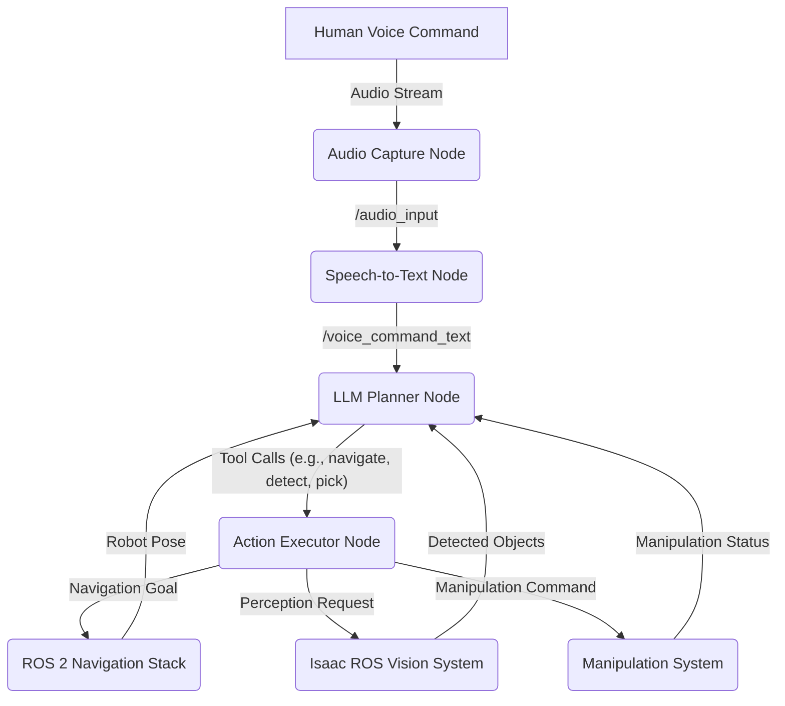

# Multimodal Interaction: Combining Speech, Vision, and Navigation for Autonomous Humanoids

## Learning Objectives

-   Understand the principles of Vision-Language-Action (VLA) systems in robotics.
-   Learn how to integrate speech, vision, and navigation components within a ROS 2 framework.
-   Explore the challenges and opportunities in building truly autonomous humanoid robots.

## Core Concepts

Multimodal interaction refers to the ability of a robot to perceive, interpret, and act upon information from multiple sensory modalities (e.g., vision, hearing, touch) and to communicate through multiple channels (e.g., speech, gestures, displays). A **Vision-Language-Action (VLA)** system is a prime example of such multimodal interaction, where robots can:

1.  **Perceive** the world through vision (cameras, depth sensors).
2.  **Understand** high-level commands and contextual information through language (speech, text).
3.  **Execute** complex actions in the physical world (navigation, manipulation).

This integration allows for robust and flexible human-robot collaboration, enabling robots to perform tasks that are verbally instructed and visually confirmed.

**Architecture of a VLA System (ROS 2 based):**

-   **Speech Recognition (STT)**: Converts human speech commands into text (e.g., using Whisper as discussed in T501). This provides the linguistic input.
-   **Natural Language Understanding (NLU) / LLM Planner**: Processes the text command to extract intent and generate a high-level action plan. This could involve an LLM (as discussed in T502) that calls robot-specific functions (tools).
-   **Vision System**: Uses cameras and perception algorithms (e.g., Isaac ROS, discussed in T402) to identify objects, understand the environment, and track targets. This provides contextual visual information.
-   **Navigation System**: Enables the robot to move autonomously to specified locations, avoid obstacles, and map its environment (e.g., ROS 2 Navigation Stack, often integrated with VSLAM from Isaac ROS).
-   **Manipulation System**: Controls the robot's arms and grippers to interact with objects (e.g., picking, placing, pushing). This executes physical actions.
-   **Feedback Loop**: The results of actions (e.g., "object grasped," "destination reached," "object not found") are fed back to the LLM planner or the user, allowing for re-planning or clarification.

**Challenges in VLA Systems:**

-   **Grounding**: Connecting abstract language concepts (e.g., "that thing," "behind you") to concrete physical entities and locations in the robot's sensory space.
-   **Ambiguity**: Handling ambiguous commands or incomplete instructions.
-   **Robustness**: Ensuring the system works reliably in varying real-world conditions (lighting, noise, clutter).
-   **Real-time Performance**: All components must operate with low latency to ensure smooth interaction and timely action execution.

## Step-by-Step Lab: Conceptual Design of a VLA Pipeline for a Humanoid Robot

This lab will outline the integration points between the speech, vision, and navigation components within a ROS 2 framework, leading towards a fully autonomous humanoid robot that responds to complex commands.

### Code Examples (Conceptual ROS 2 Nodes and Topics)

Consider the command: "Robot, go to the red box and pick it up."

1.  **Speech-to-Text Node**: Transcribes the audio.
    -   Publishes to: `/voice_command_text` (std_msgs/String)
2.  **LLM Planner Node**: Subscribes to `/voice_command_text`, uses LLM function calling to generate a plan of robot actions.
    -   Publishes to: `/robot_action_plan` (CustomActionPlan message type)
    -   Available Tools (conceptual ROS 2 actions/services):
        -   `navigate_to_pose(x, y, yaw)` (ROS 2 Nav2 Action)
        -   `detect_object(object_name)` (Custom Service/Action, uses Vision System)
        -   `pick_object(object_name)` (Custom Action, uses Manipulation System)

3.  **Vision System (Isaac ROS)**: Provides object detection and localization.
    -   Subscribes to: `/camera/rgb/image_raw`, `/camera/depth/image_raw`
    -   Publishes to: `/perception/detected_objects` (CustomDetectedObjects message type)

4.  **Navigation System (ROS 2 Nav2)**: Handles path planning and robot movement.
    -   Subscribes to: `/robot_action_plan` (for navigation goals), `/perception/map_updates`
    -   Publishes to: `/cmd_vel` (geometry_msgs/Twist)

5.  **Manipulation System**: Executes grasping.
    -   Subscribes to: `/robot_action_plan` (for manipulation goals), `/perception/object_pose`
    -   Publishes to: `/manipulation/status` (CustomManipulationStatus message type)

**Example VLA Workflow:**

### Hardware/Cloud Alternative

Building a full VLA system requires significant computational resources.

-   **Local Machine**: A powerful workstation with a high-end NVIDIA GPU is recommended for running all components simultaneously in simulation.
-   **Distributed System**: For physical robots or complex simulations, different components (e.g., STT, LLM planner, vision) might run on different machines or even cloud instances, communicating via ROS 2.
-   **Jetson Devices**: Jetson platforms are ideal for deploying the perception and possibly some of the local planning components on the robot itself.

## Summary

Multimodal interaction and VLA systems represent the forefront of autonomous humanoid robotics. By seamlessly integrating speech recognition, LLM-based cognitive planning, computer vision, and robust navigation and manipulation capabilities within a ROS 2 framework, robots can understand and execute complex natural language commands. This integration is key to unlocking truly intelligent and intuitive human-robot collaboration.

## Assessment / Mini Project

1.  **Question**: In a VLA system, what is the role of "grounding" and why is it a challenge?
2.  **Question**: How does a VLA system combine the strengths of both symbolic AI (planning) and data-driven AI (vision, language models)?
3.  **Mini-Project**: Research the concept of a "behavior tree" in robotics. How could a behavior tree be used in conjunction with an LLM planner to manage the execution of high-level plans and handle unexpected events in a VLA system?
